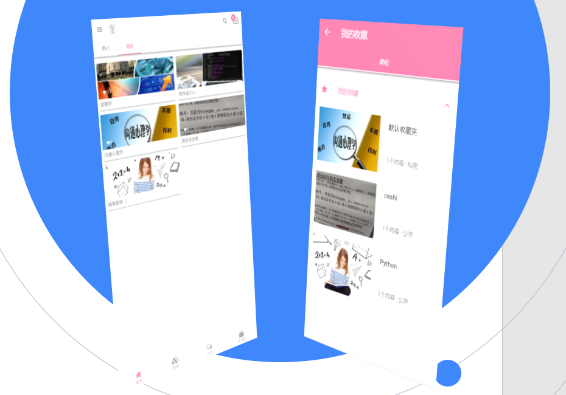
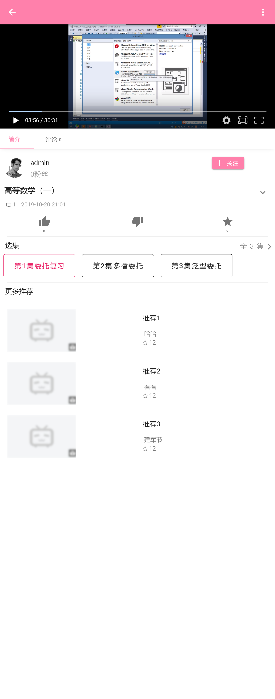
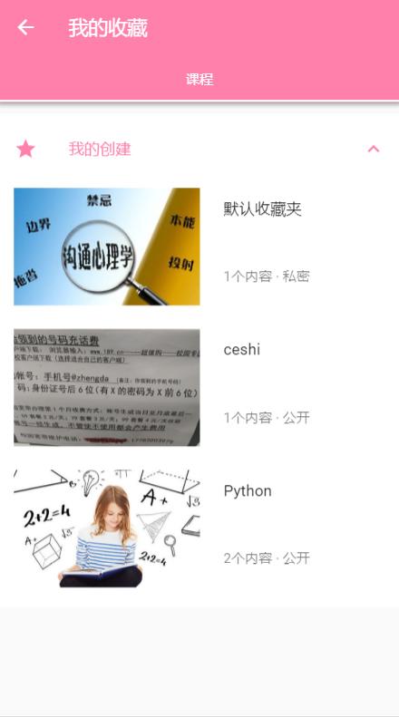
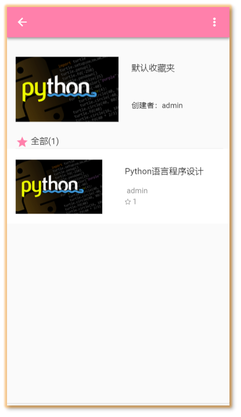
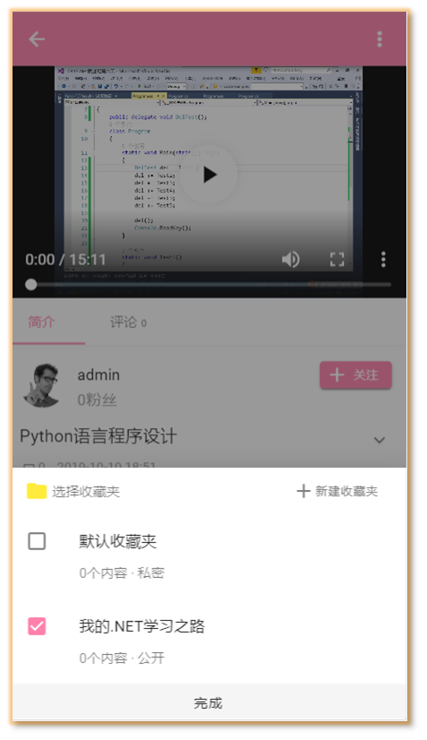
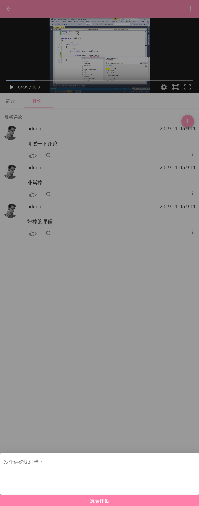
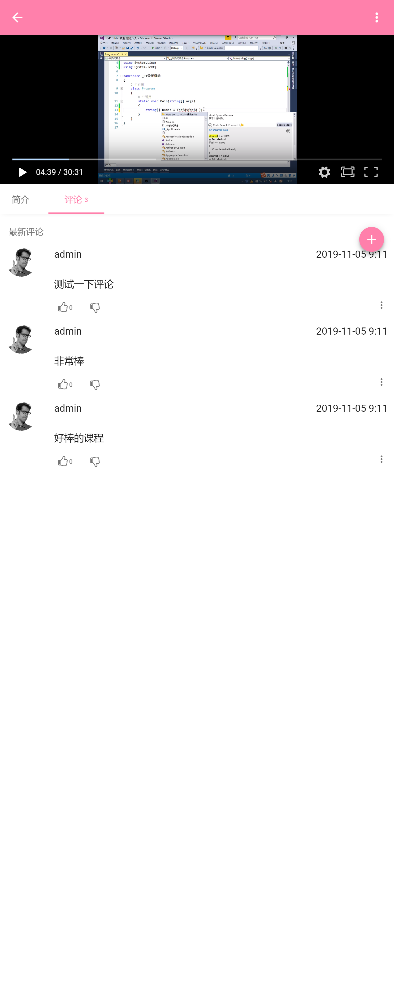

<h1 align="center">remember-app</h1>

> :cake: 一个百宝袋，希望能帮到你

[]
()

[English](README_en.md)

## 介绍

remember-app: remember for mobile app.   

一个百宝袋，主要是学习工具
 + **优雅** - 简单易用
 + **丰富** - 各种各样的工具
 + **免费** - 免费下载

 ## 截图

 
## TODO

- [ ] 等待补充
- [ ] 等待补充
- [ ] 等待补充
- [ ] 等待补充
- [ ] 等待补充

## 持续集成

待补充

## 依赖

只需要满足下方其中一条.

- .NET Framework (>= 4.0) 且 Newtonsoft.Json (>= 4.5.11) 被安装.
- .NET Standard (>= 2.0) 且 Microsoft.CSharp (>= 4.5.0), Newtonsoft.Json (>= 9.0.1) 被安装.

## 环境

- 运行环境: .NET Framework (>= 4.0) or .NET Standard (>= 2.0)    
- 开发环境: Visual Studio Community 2017

## 相关项目

- [remember](https://github.com/yiyungent/remember)
 
## 鸣谢

- 本项目...

## Author

**remember-app** © [yiyun](https://github.com/yiyungent), Released under the [Apache 2.0](./LICENSE) License. 
Authored and maintained by yiyun with help from contributors ([list](https://github.com/yiyungent/remember-app/contributors)).

> GitHub [@yiyungent](https://github.com/yiyungent)

## License
