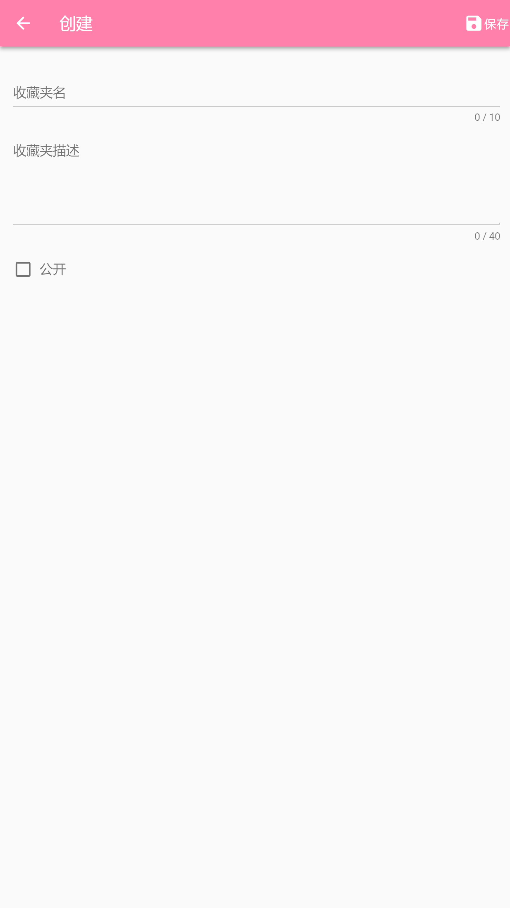

<h1 align="center">remember-app</h1>

> :cake: 一个多人博客APP

## 介绍

remember-app: remember for mobile app.   

一个多人博客APP
 + **优雅** - 简单易用，美观大方
 + **免费** - 免费下载
 
 ## 技术栈
 
主要: Vue.js, Vue-Router, Vuex, Vuetify, Vant, Mockjs, Cordova

 ## 扫描二维码在手机浏览器体验
 

 ## 截图

 ##### 截图为旧版本，最新稳定版请扫描上方二维码体验

 
## TODO

- 见Projects

## 相关项目

- [remember](https://github.com/yiyungent/remember)

## Donate

remember-app is an Apache-2.0 licensed open source project and completely free to use. However, the amount of effort needed to maintain and develop new features for the project is not sustainable without proper financial backing.

We accept donations through these channels:
- <a href="https://afdian.net/@yiyun" target="_blank">爱发电</a>
 
## Author

**remember-app** © [yiyun](https://github.com/yiyungent), Released under the [Apache-2.0](./LICENSE) License. 
Authored and maintained by yiyun with help from contributors ([list](https://github.com/yiyungent/remember-app/contributors)).

> GitHub [@yiyungent](https://github.com/yiyungent)

